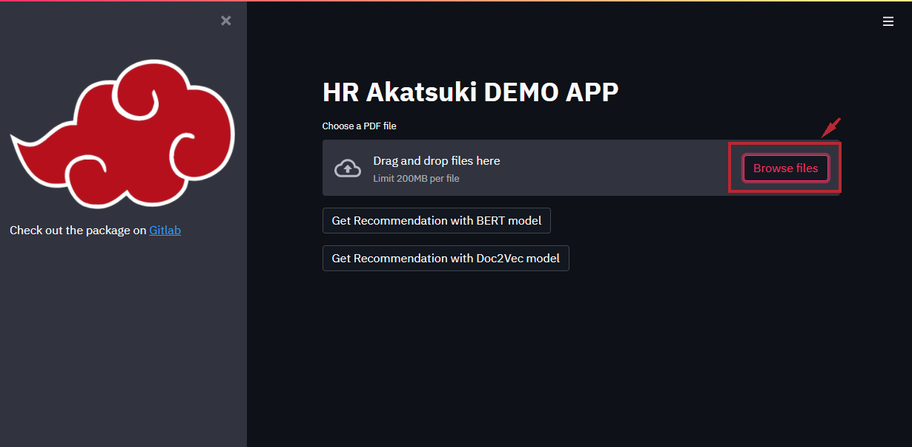
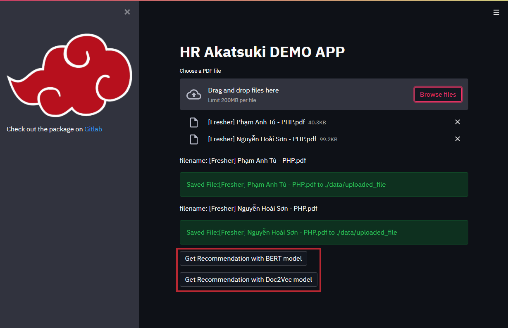
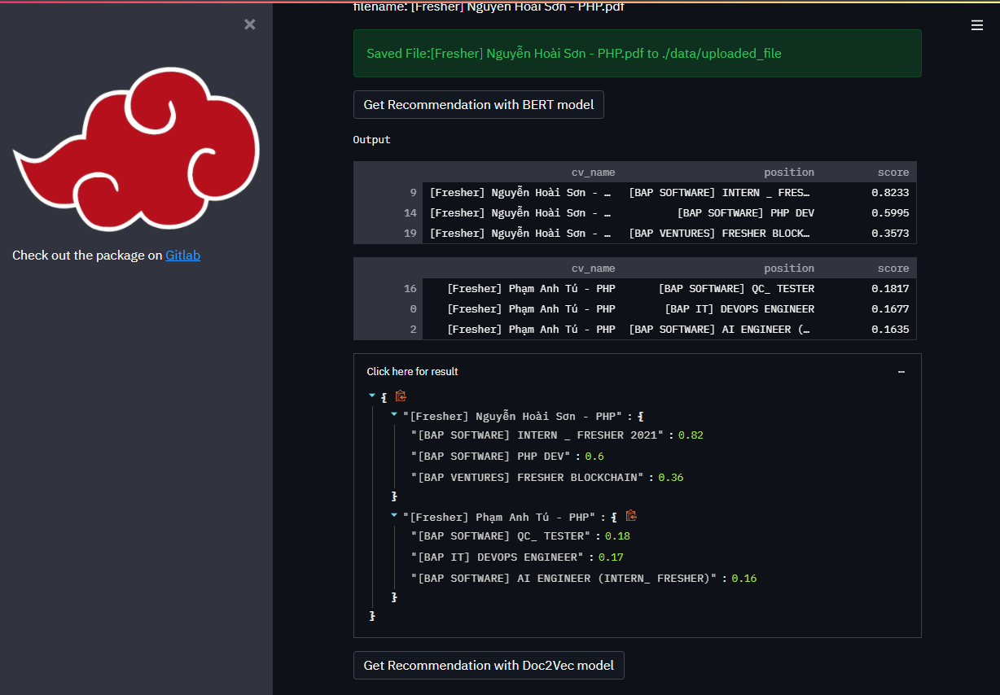

# Description
We have built a Resume & Job Description Matching System using Deep Learning.

# Installation

```shell
pip install -q requirements.txt
```

# Demo
Run demo with Streamlit

```shell 
streamlit run test.py
```

The demo app will be opened at http://localhost:8501/

(Optional): FastAPI 

```shell
python app.py
```

You can view the docs at http://localhost:8008/docs

# Usage/Example
Step 1: Choose the resume to upload to system.



Step 2: Choose to get recommendation with BERT model or Doc2Vec model.



Step 3: Show the results.

